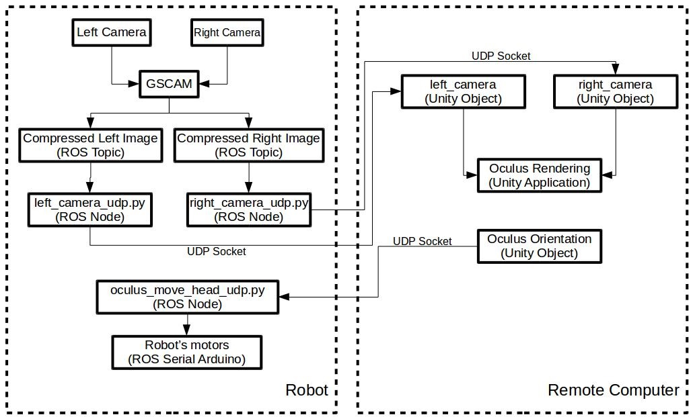

## Using two cameras to generate 3D images for the Oculus Rift CV1**

Author: Francisco Erivaldo Fernandes Junior

**System requirements:**

**In the robot:**

- Ubuntu Linux 14.04 or later
- ROS Indigo Igloo or later
- Two USB webcams compatible with gstreamer (I am using the Logitech QuickCam).

**In the remote computer**

- Windows 10
- Unity game engine 5.4.2 or later
- Oculus software

**How it works**

The cameras connected in the robot will send images to the remote computer to be displayed in the Oculus Rift CV1.

The robot should be running the following ROS Packages:

- GSCAM: This package is responsible for connecting both cameras with ROS. It is basic a ROS driver for the cameras.
- OCULUS\_STEREO\_CAMERA\_UDP: This package will convert the images for each camera (right and left) to Base64 strings and send them to the remote computer (where the Oculus CV1 is installed) using UDP sockets. Also, this package will also be able to receive back the orientation of the HMD through another UDP socket, and it will control the movements of the robot&#39;s head according to the movements of the HMD.

The remote computer should be running the Unity application called &quot;oculus\_stereo\_camera&quot;. This application will be responsible for receiving the images from the robot and sending the orientation of the Oculus CV1 using  UDP sockets.

A system overview is illustrated in the image below:

**How to install**

1.) Put the ROS Packages GSCAM and OCULUS\_STEREO\_CAMERA\_UDP in your CATKIN WORKSPACE, and compile them.

2.) Import the folder oculus\_stereo\_camera to your Unity projects. Also, don&#39;t forget to install the Oculus software.

**How to use**

1.) Verify your webcam address on Ubuntu using Cheese. Normally, it will be on **/dev/video0** and **/dev/video1**. If your webcam addresses are different, you should edit the file **3d\_oculus.launch** located in **gscam/examples/** to match your webcams (LEFT\_DEV and RIGHT\_DEV lines).

2.) Run **gscam** with the following command: **roslaunch gscam 3d\_oculus.launch**

3.) Run **oculus\_stereo\_camera\_udp** nodes: **roslaunch oculus\_stereo\_camera\_udp nodes.launch**

4.) Run the Unity application **oculus\_stereo\_camera\_udp**.

5.) Put the goggles and test it.

**Troubleshooting**

If you cannot initialize **gscam** package, please verify the resolution and framerate in the file **3d\_oculus.launch** inside the folder **examples**. These can be found the lines 9, 10 and 11 (WIDTH, HEIGHT, and FPS). Some cameras are not compatible with some combination of resolution and framerate. Please, try to find the best combination for your camera.
